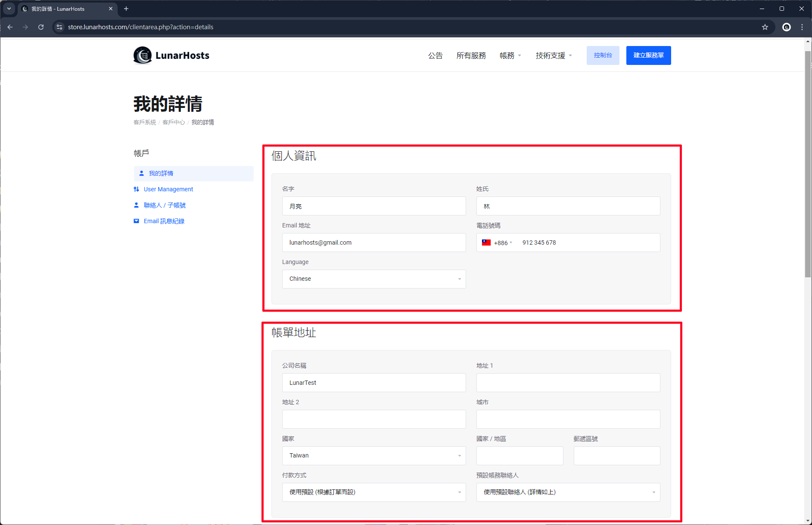

# 修改個人相關資訊

### 前往客戶中心

前往 [**客戶中心**](https://store.lunarhosts.com/) 點選右上角使用者的頭像，再點選 **我的詳情**。

<figure><figcaption></figcaption></figure>

### 相關設定

#### 個人資訊

個人資訊裡面可以修改：

* 您的姓名
* Email地址
* 電話號碼
* 瀏覽客戶中心網站的語言

#### 帳單地址

帳單地址可以修改：

* 公司名稱
* 主要地址
* 次要地址
* 所在城市
* 所在國家
* 所在地區
* 郵遞區號
* 付款方式
* 預設帳務聯絡人

#### 其他資訊

其他資訊裡面需要您確認勾選 "我確認填寫真實資料" 確認此帳號資料是正確且屬實的。

<figure><figcaption></figcaption></figure>

<figure><figcaption></figcaption></figure>
