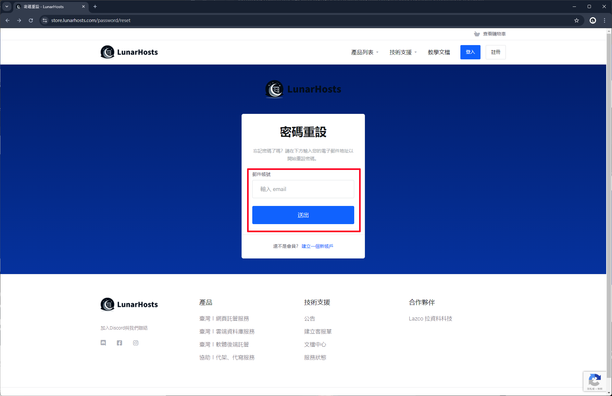

# 重置客戶中心密碼

## 前往客戶中心

進入 [**客戶中心**](https://store.lunarhosts.com/) 點選右上角 "登入"。

<figure><figcaption></figcaption></figure>

點選 "忘記密碼" 按鈕。

<figure><figcaption></figcaption></figure>

輸入註冊客戶中心帳號的 Email 地址，輸入完點選 "送出" 按鈕。

<figure><figcaption></figcaption></figure>

接下來去輸入的信箱查看信件。

<figure><figcaption></figcaption></figure>

收到信件後請點選 "立即重設密碼" 按鈕。

<figure><figcaption></figcaption></figure>

輸入新的密碼，輸入完後點選 "儲存變更" 按鈕，接著就可以再次登入帳號囉。

<figure><figcaption></figcaption></figure>
