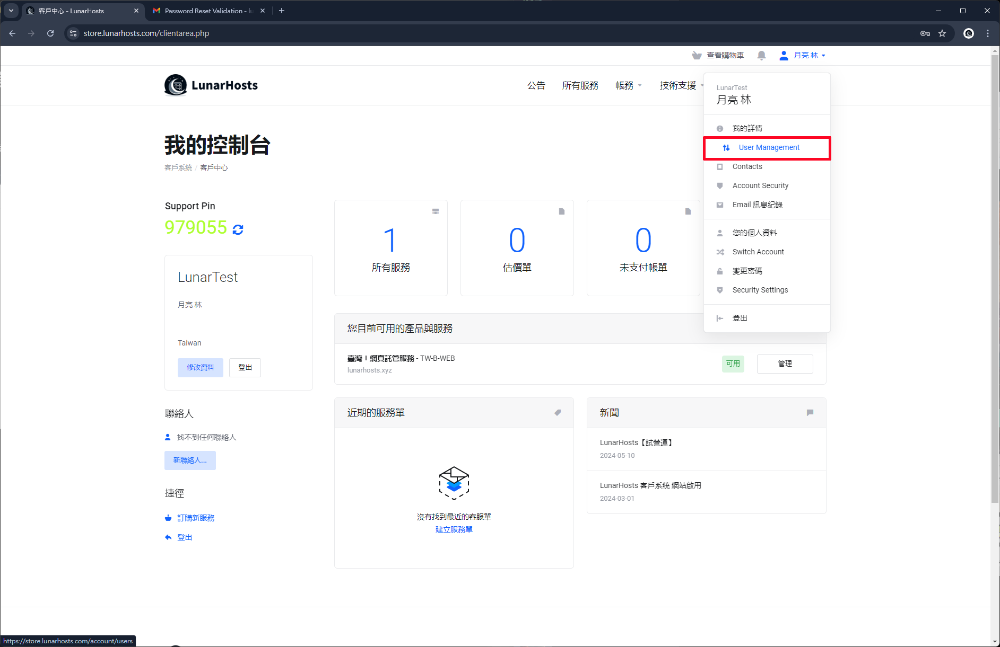
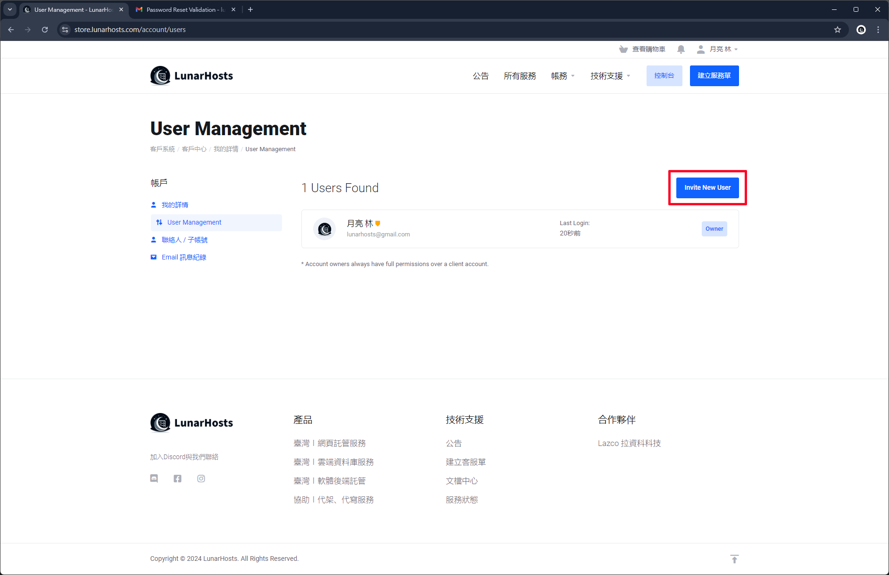
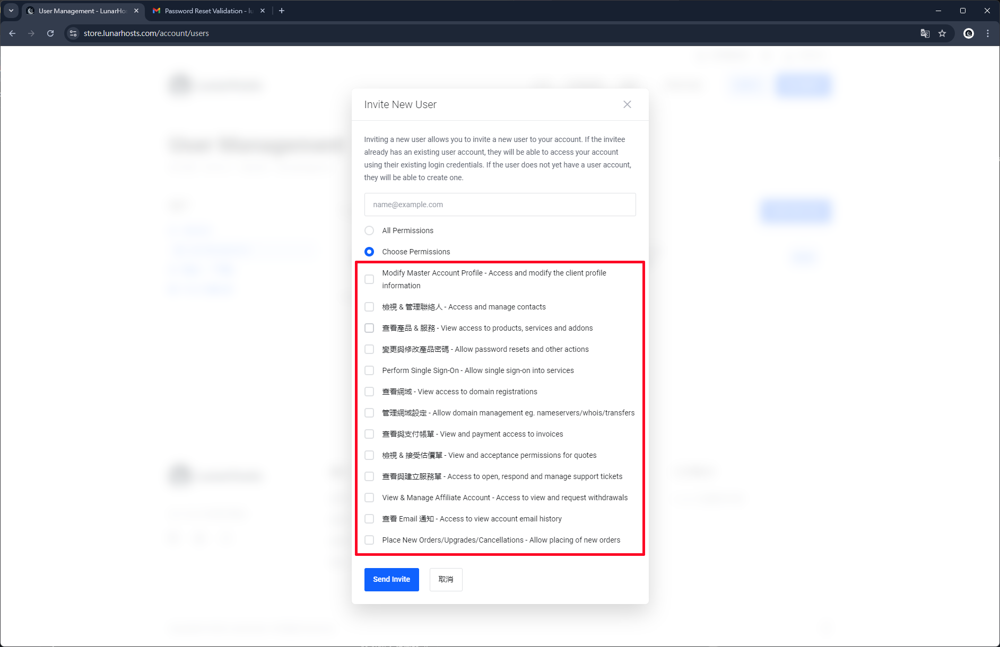
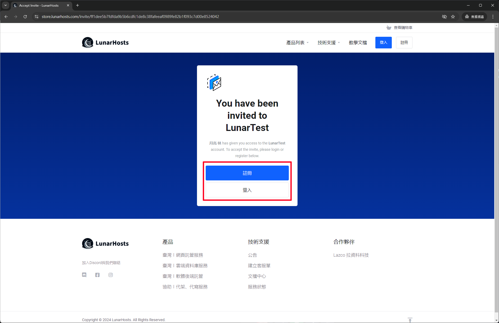

# 分享使用者帳號

## 選擇使用者管理

點選右上角使用者，再點選使用者管理

<figure><figcaption></figcaption></figure>

## 邀請新使用者


共用使用者會看見主要使用者部分個人資料，邀請前請注意。


點選 **邀請新使用者** 按鈕。

<figure><figcaption></figcaption></figure>

## 設定分享使用者權限

先輸入新使用者的 Email地址，在選擇給予權限。

### 權限分類

* 所有權限&#x20;

<figure><figcaption></figcaption></figure>

* 選擇權限

<figure><figcaption></figcaption></figure>

## 邀請者確認

確認邀請後，邀請者會在 Email信箱查看郵件，並點選郵件內的連結去做確認加入動作。

<figure><figcaption></figcaption></figure>

在還沒登入的請況下，會跳出要您註冊或登入來接受邀請。

<figure><figcaption></figcaption></figure>

在已經登入的情況下，就會直接跳出接受邀請的按鈕，按下來接受邀請。

<figure><figcaption></figcaption></figure>

未來登入帳號時，系統會詢問要選擇使用的帳號，以供您選擇。
