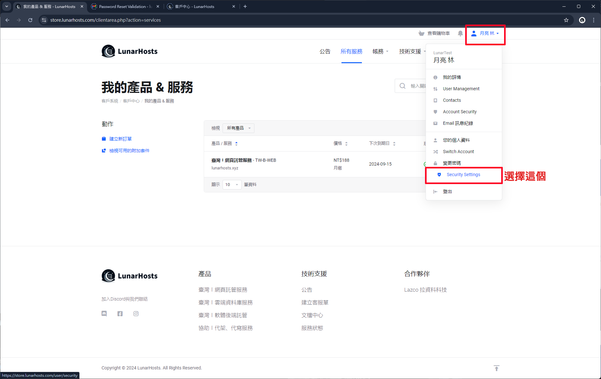
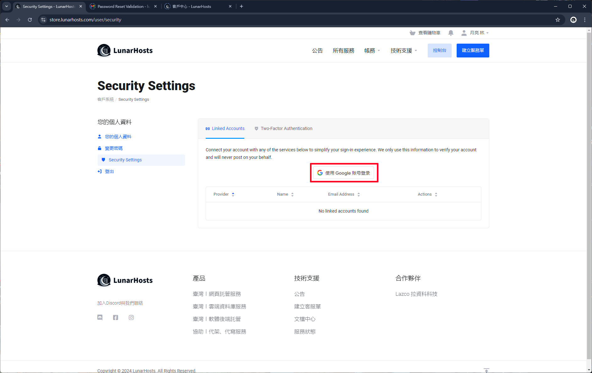
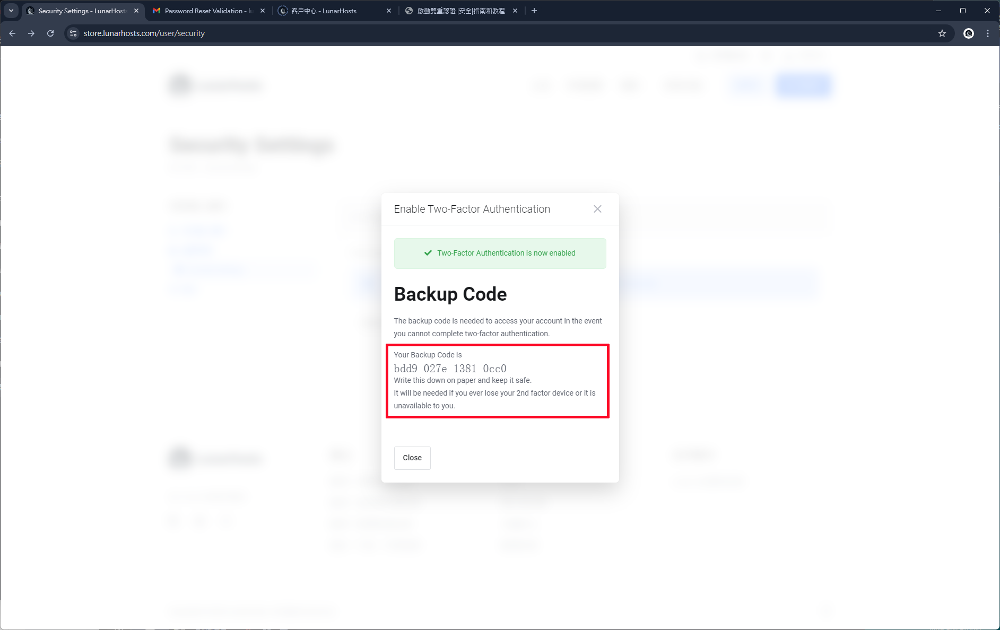

# 啟用雙重驗證

### 點選用戶

點選 客戶中心 右上角的 "用戶"，再點選 "雙重驗證" 的選項。

<figure><figcaption></figcaption></figure>

### 第三方登入 ( 可選 )

可以選擇 Google 帳號登入。

<figure><figcaption></figcaption></figure>

### 開啟雙重驗證

點選雙重驗證按鈕，手機下載 [**Google Authenticator** ](https://play.google.com/store/apps/details?id=com.google.android.apps.authenticator2\&hl=zh\_TW) 透過掃描 QR Code 或輸入代碼來加入驗證。

<figure><figcaption></figcaption></figure>

### 成功啟用雙重驗證


啟用後會顯示備用代碼，請務必把備用代碼複製儲存起來，如忘記或遇到驗證輸入無效時使用。


輸入好六位數的驗證代碼後，就會成功啟用雙重驗證功能了。

<figure><figcaption></figcaption></figure>

