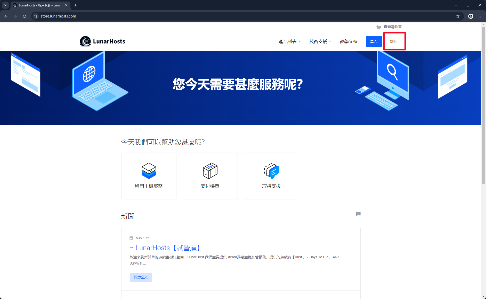
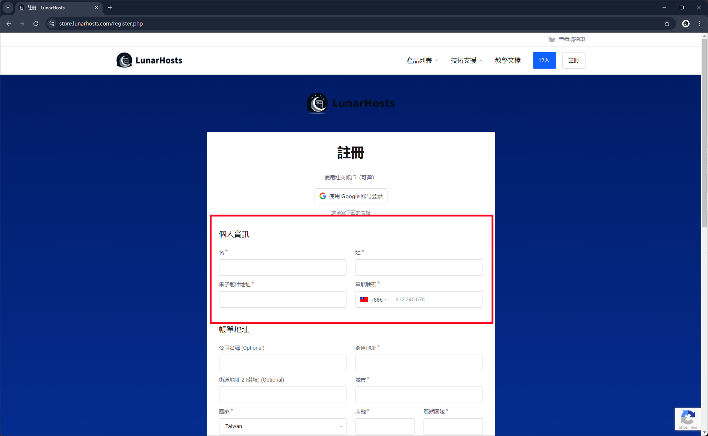
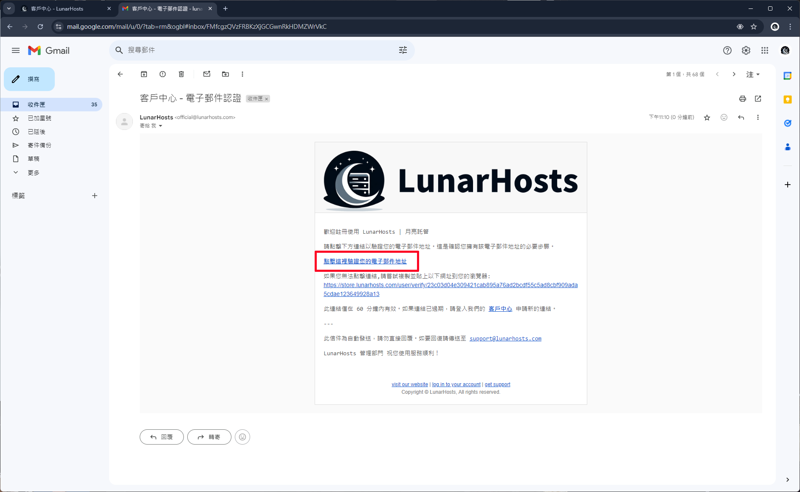
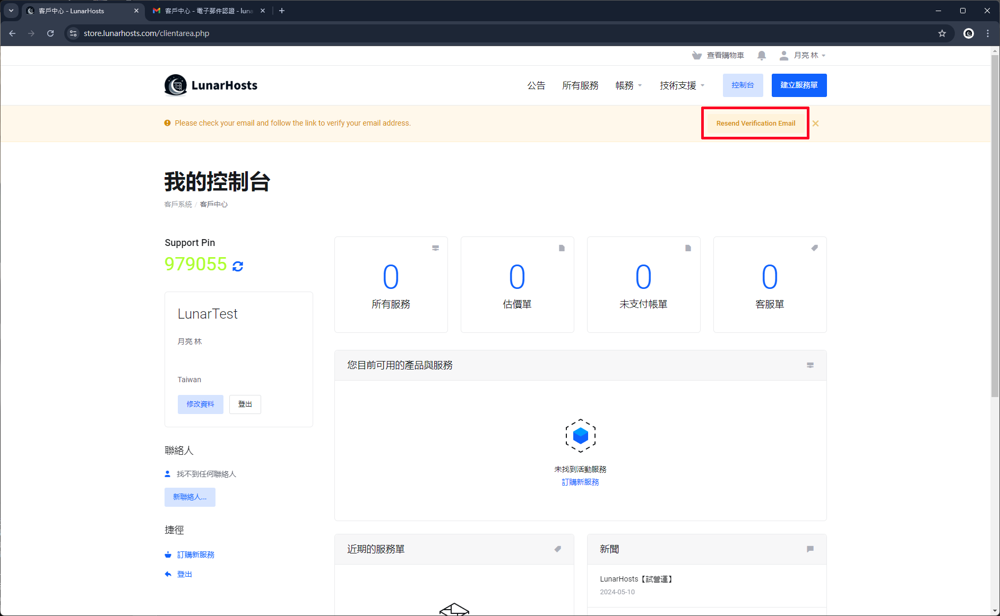

# 創建帳號

## 前往客戶中心

首先進入 [**客戶中心**](https://store.lunarhosts.com/)，並點選右上角**註冊**按鈕。

<figure><figcaption></figcaption></figure>

## 填寫註冊資料

### 個人資訊

填入個人資料及電子郵件，或直接透過 Google 帳號登入，在繼續填寫個人資料。

### 帳單地址

填寫您的通訊地址。(注意：目前是使用電子式收據)

<figure><figcaption></figcaption></figure>

### 真實資料

確認您上面的資訊是真實的之後，請勾選。

### 帳戶安全

輸入您想要設定的密碼。(記得需要高強度的密碼)

<figure><figcaption></figcaption></figure>

## 驗證電子郵件

為了確定此電子郵件&使用者帳號是本人使用，所以需要進行驗證。

註冊好帳號後，系統會自動發送一封驗證郵件給您，並點選信件內的驗證按鈕，信件內容如下：

<figure><figcaption></figcaption></figure>


如註冊後沒收到信件，可回客戶中心點選再次傳送驗證郵件。


<figure><figcaption></figcaption></figure>

恭喜您成功完成創建帳號，開始購買服務吧！
