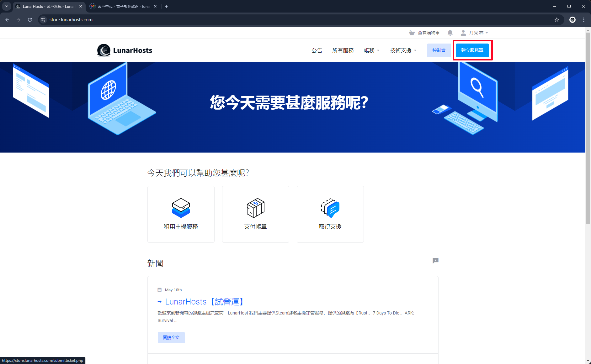
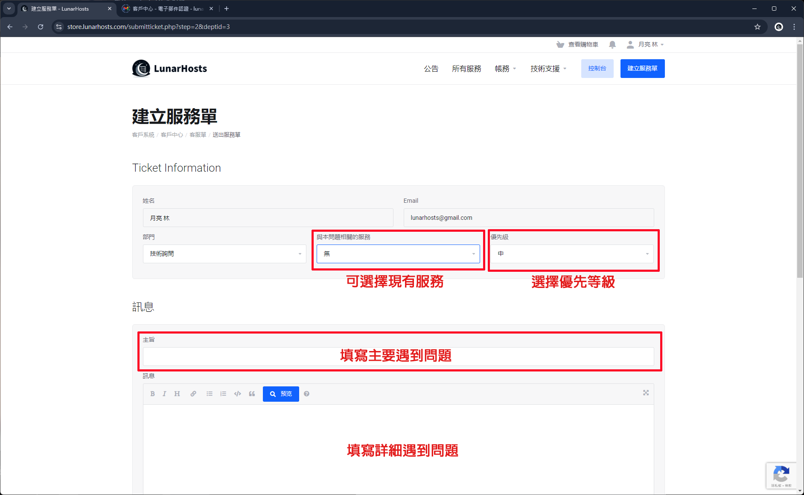
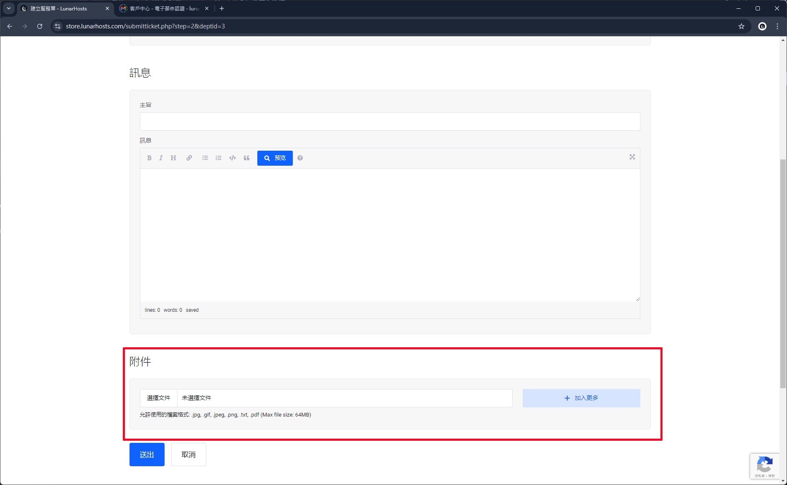

# 創建客服單

### 前往客戶中心

前往 [客戶中心](https://store.lunarhosts.com/) 點選右上角 **建立客服單。**

<figure><figcaption></figcaption></figure>

## 選擇客服單類型

根據您目前遇到的問題，選擇相應的客服單類型來建立，並同時提出您的疑問。

<figure><figcaption></figcaption></figure>

### 填寫客服單內容

* 相關服務：如果您的問題是在使用服務期間遇到，請選擇該服務，若無則無需選擇。
* 優先級：
  * 高：適用於緊急案件 (預計處理時間：30分鐘至1小時)
  * 中：適用於一般案件 (處理時間不定)
  * 低：適用於不急迫的案件 (處理時間不定)
* 主旨：簡述您遇到的問題。
* 訊息：詳細說明您遇到的問題。

<figure><figcaption></figcaption></figure>

### 客服單附件

如果遇到的問題用文字敘述不是很清楚，可上傳圖檔來讓客服人員更快速地了解並解決您的問題。

<figure><figcaption></figcaption></figure>

確認好後，按下送出，接著請等待客服人員來回覆處理。
