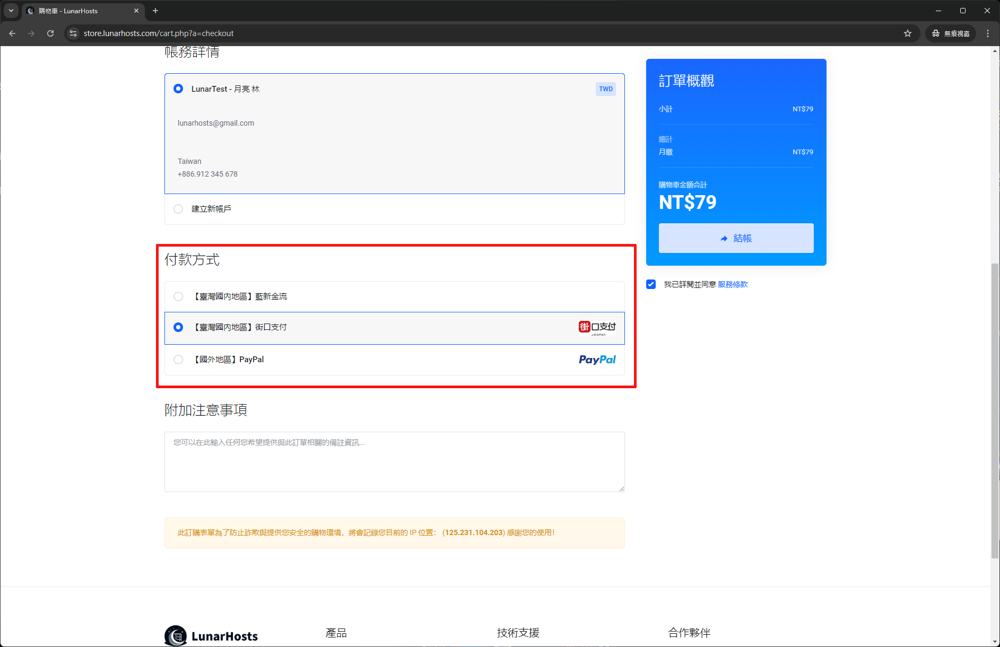
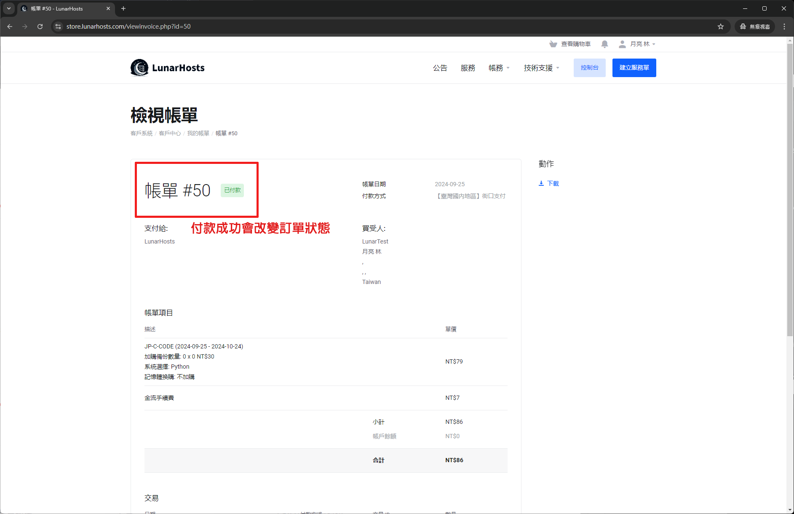

# 街口支付教學


請注意！此付款方式僅限定於 **街口支付** 專用 QRCode，無法使用 TWQR 付款請見諒！


選擇需要購買的服務後，點選 "街口支付" 成為您的付款方式，點選**付款**。

<figure><figcaption></figcaption></figure>

轉跳到付款畫面之後，系統會自動跳出付款的 **QR Code**，透過 **街口支付App** 掃描。

<figure><figcaption></figcaption></figure>

付款完之後，將帳單畫面重新整理，系統會偵測付款是否成功，成功之後會改變**訂單狀態**。

<figure><figcaption></figcaption></figure>

訂單狀態改變了就可以開始使用服務囉！！


如果在付款成功且重新整理後，網頁並沒有改變訂單狀態時，請立即與我們聯繫。

