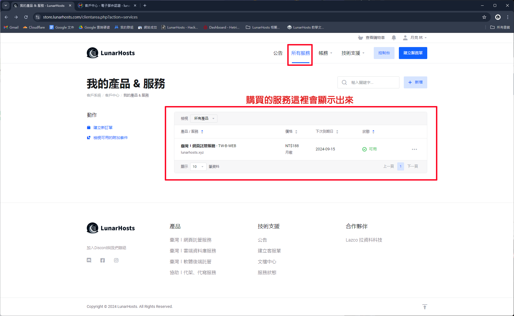

# 購買服務

## 前往產品頁面

前往 [**產品頁面**](https://store.lunarhosts.com/store/) 找尋您想要購買的產品。

<figure><figcaption></figcaption></figure>

## 如何購買？

### 選好產品

選擇好您想要購買的產品方案後，點選方案下方的**立即購買按鈕。**

<figure><figcaption></figcaption></figure>

### 輸入網域


注意！輸入網域只有網頁託管服務需要。


* 開頭填寫網域名稱 (例：lunarhosts)
* 結尾填網域結尾 (例：xyz)

填寫完請按使用，接著會跳至下一步操作。

<figure><figcaption></figcaption></figure>

### 選擇循環出帳類型

我們目前提供兩種循環出帳的類型，您可以自行選擇。如日後需要更改，需開啟客服單通知客服人員。

<figure><figcaption></figcaption></figure>

### 付款前確認

付款前會需要您選擇付款方式，我們目前提供了幾種付款方式，選擇好後並將右方的 "我已詳閱並同意 服務條款" 勾選起來，付款完您就可以開始使用服務了。

<figure><figcaption></figcaption></figure>

### 查看現有服務

購買好後，點選上方的 **所有服務** 來查看剛剛購買的產品。

<figure><figcaption></figcaption></figure>

點開剛剛購買的產品，會看到產品相關的資訊。

<figure><figcaption></figcaption></figure>

恭喜您成功購買產品，開始去使用吧\~
