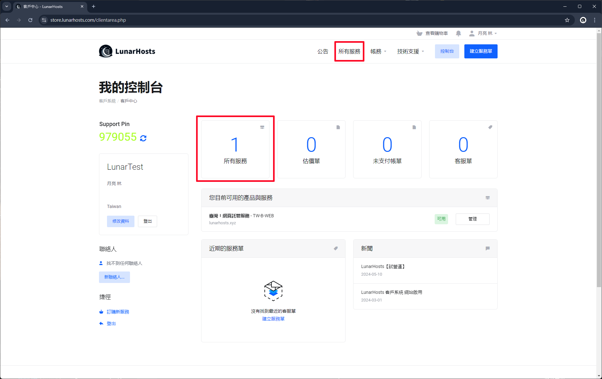
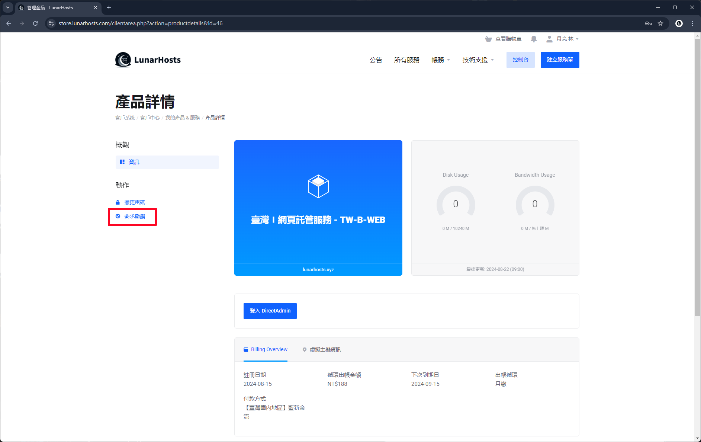
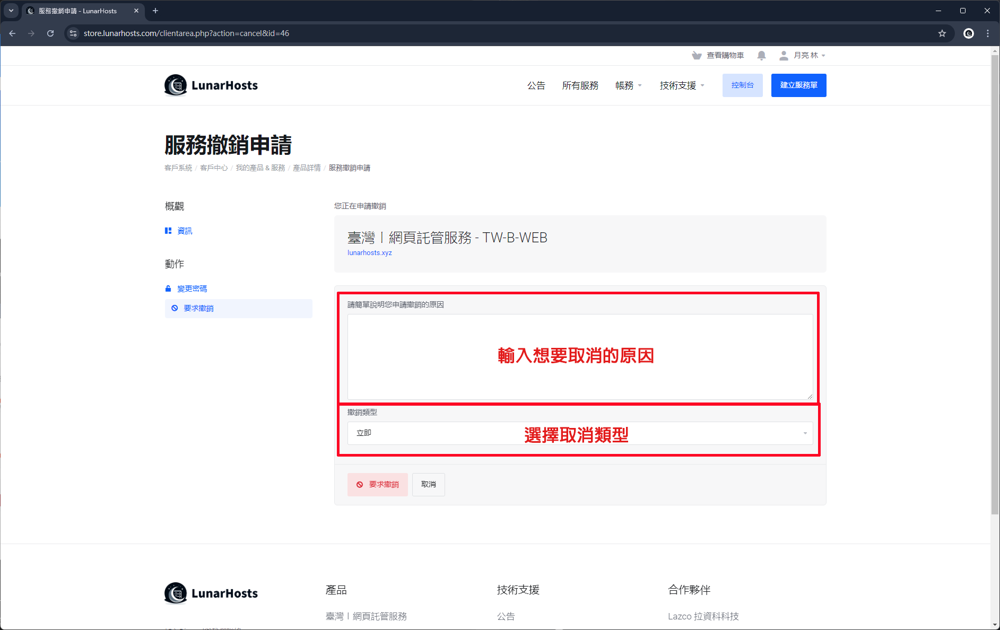

# 申請取消服務


申請取消服務後，表示您已經知道並同意取消服務[**免責聲明**](../../service-policy/terms-of-service.md#wu-mian-ze-sheng-ming)。


## 前往客戶中心

進入 [**客戶中心**](https://store.lunarhosts.com/) 點選右上角 "登入"。

<figure><figcaption></figcaption></figure>

登入成功點選上方或中間的 "所有服務"。

<figure><figcaption></figcaption></figure>

選擇您現在想要取消的服務。

<figure><figcaption></figcaption></figure>

## 要求撤銷

點選左方的 "要求撤銷"。

<figure><figcaption></figcaption></figure>

輸入申請的原因及取消類型。

* 輸入取消原因：可以給我們建議或是使用這個產品的缺點，讓我們可以從這些建議及缺點去改進。
* 取消類型：有兩種，立即取消及等待帳單周期結束。

<figure><figcaption></figcaption></figure>

成功送出申請後，請耐心等待服務刪除。

<figure><figcaption></figcaption></figure>


如果您突然改變心意或是不小心送出錯誤申請，請立即與我們聯絡。

