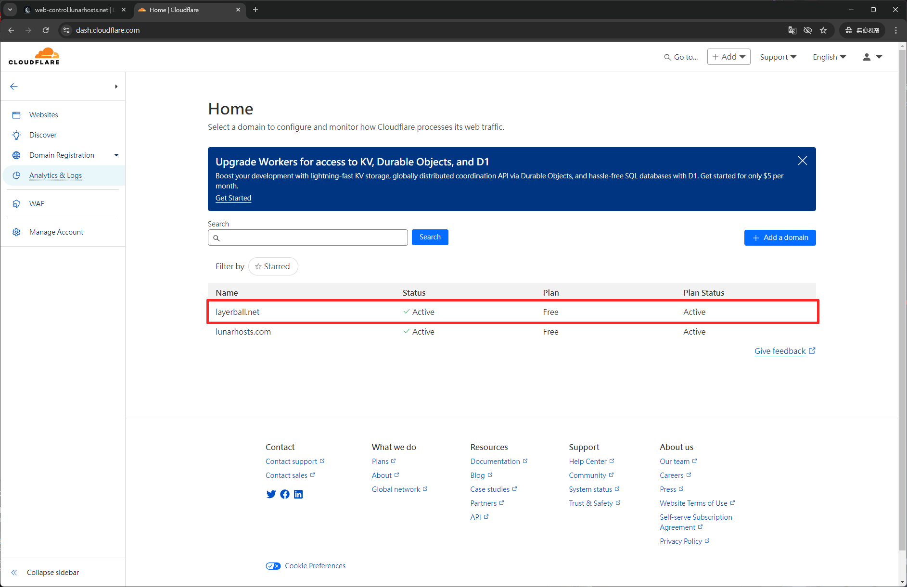

# 主網域 DNS

## 登入網頁控制面板

前往 [https://web-control.lunarhosts.net:2222/evo](https://web-control.lunarhosts.net:2222/evo) 登入帳號。

<figure><figcaption></figcaption></figure>

### 從 **`Account Manager`** 類別裡面點選 **`DNS 管理`**&#x20;

<figure><figcaption></figcaption></figure>

看到主網域的 **`A 紀錄`** 裡面的值輸入 **`160.30.99.68`** 先記得這個。

<figure><figcaption></figcaption></figure>

## 前往 Cloudflare 控制面板

前往 [https://dash.cloudflare.com/](https://dash.cloudflare.com/) 登入並選擇自己的網域。

<figure><figcaption></figcaption></figure>

### 新增 DNS 紀錄

點選 DNS 紀錄。

<figure><figcaption></figcaption></figure>

點選新增紀錄，範例格式如下。

<figure><figcaption></figcaption></figure>

範例格式：

| Type | Name |     IPv4     | Proxy |
| :--: | :--: | :----------: | :---: |
|   A  |   @  | 160.30.99.68 |   開啟  |


注意！Name 的 @ 代表主網域，如果要手打主網域也是可行的。Proxy 一定要開啟。


新增結束後去瀏覽自己的網域，正常情況下會顯示下方圖片同樣的畫面。

<figure><figcaption></figcaption></figure>

這樣前置作業就完成了，開始建立自己的網站吧！！
