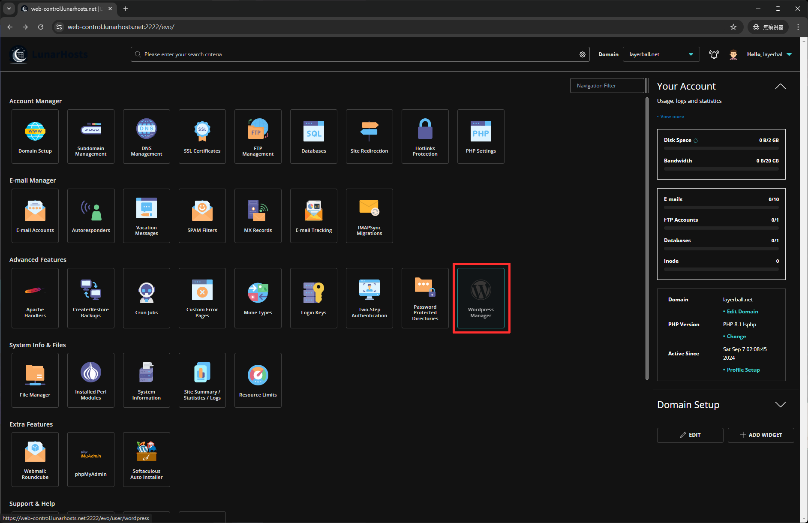
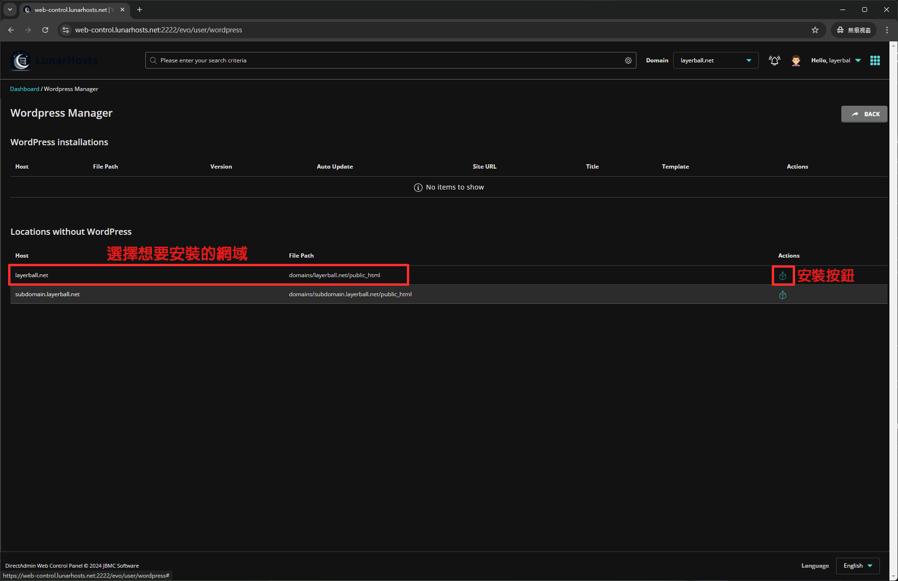
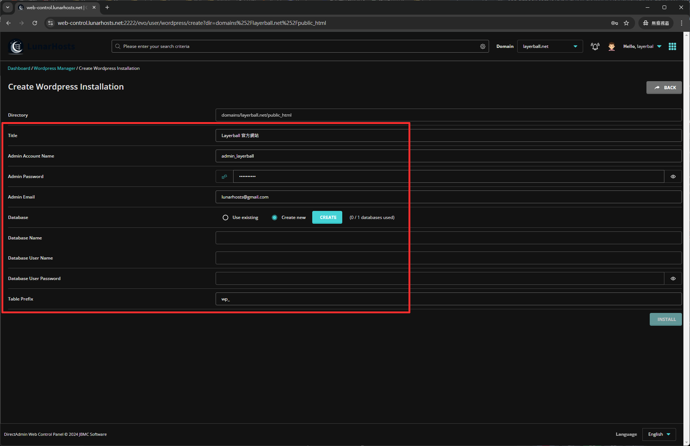
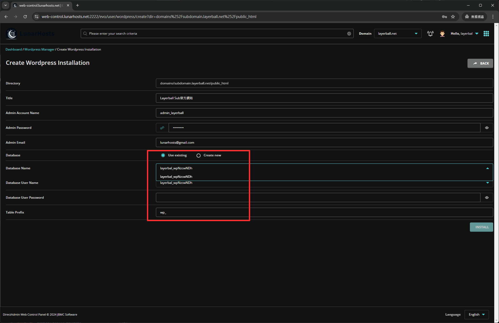
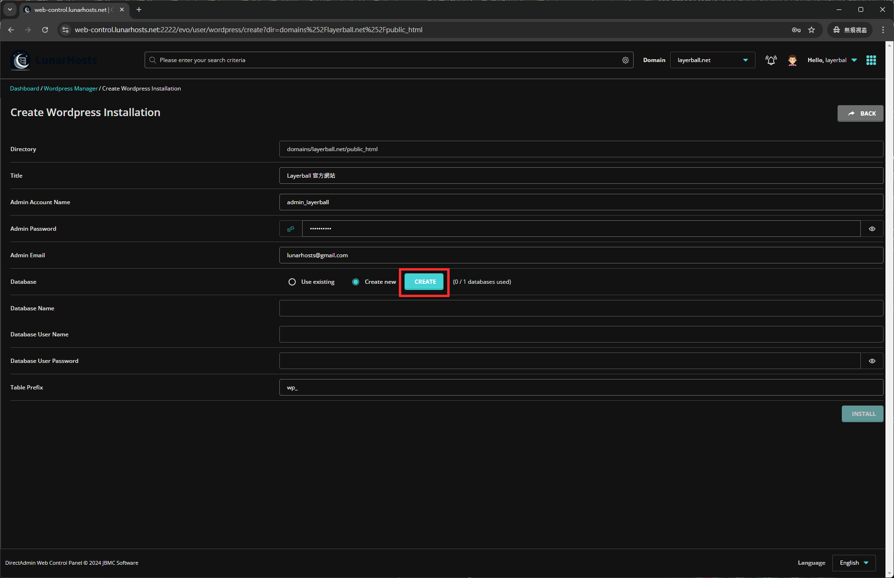
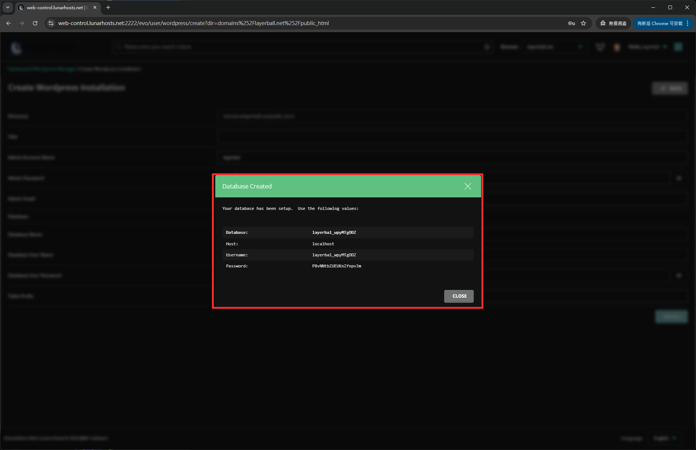
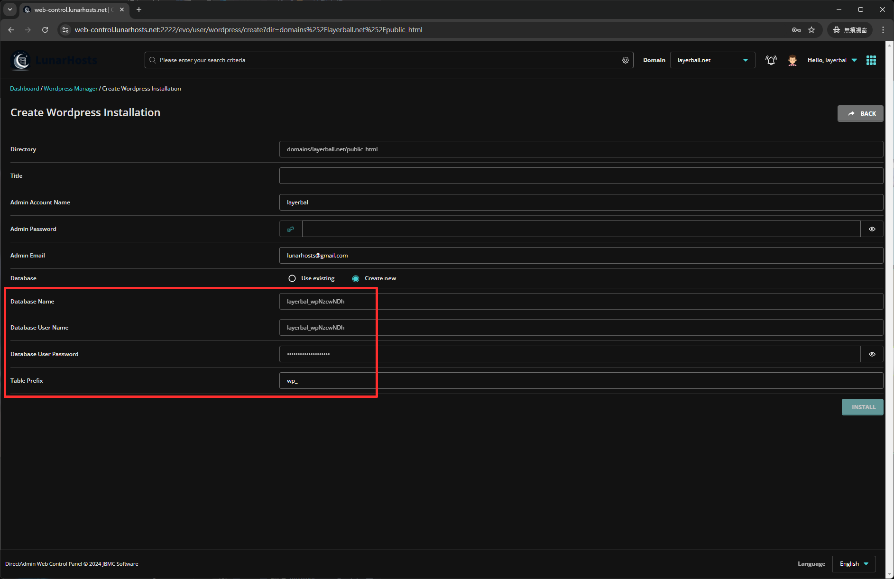
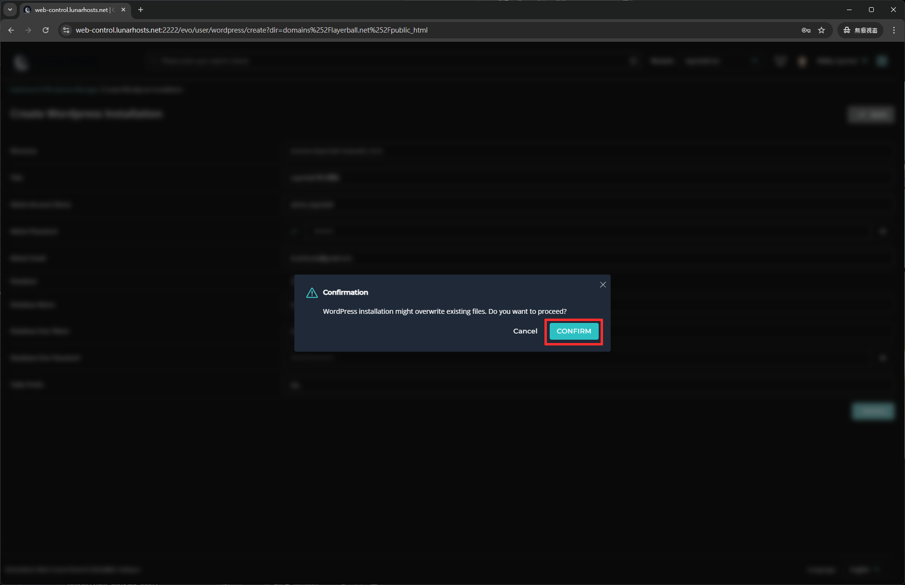
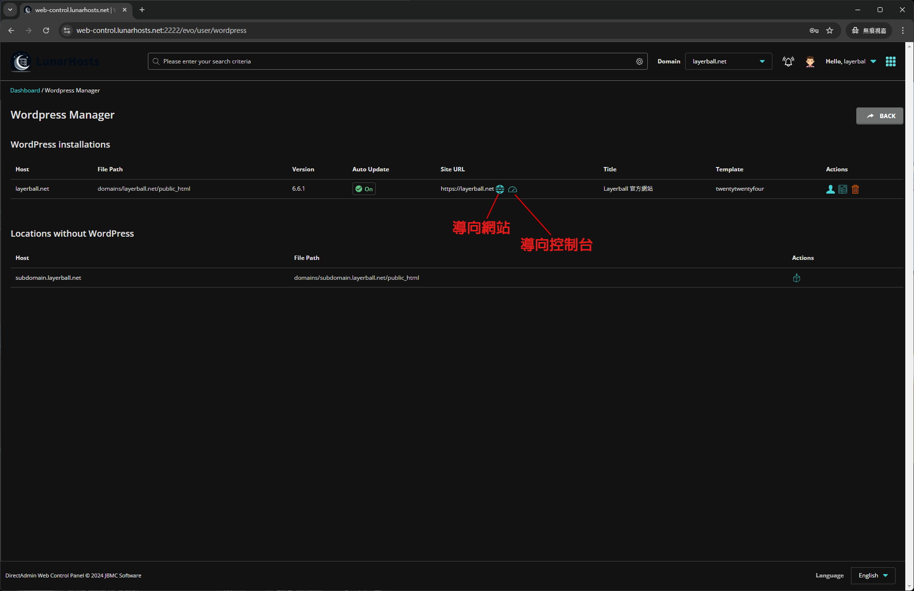

# Wordpress 系統安裝

## 進入網頁控制介面

點選 **`Advanced Features`** 裡面的 **`Wordpress 管理`**。

<figure><figcaption></figcaption></figure>

## 安裝 Wordpress

選擇想要安裝的網域，並點選右邊的安裝按鈕。

<figure><figcaption></figcaption></figure>

輸入下方需要填入的資料，範例格式如下：

<figure><figcaption></figcaption></figure>

<table><thead><tr><th width="88">Title</th><th width="148">Admin Account Name</th><th width="157">Admin Password</th><th width="129">Admin Email</th><th width="130">Database</th><th width="153">Database Name</th><th>Database User Password</th></tr></thead><tbody><tr><td>標題</td><td>設定管理員帳號</td><td>管理員密碼</td><td>管理員Gmail</td><td>選擇有或創新</td><td>填入資料庫名稱</td><td>資料庫密碼</td></tr></tbody></table>

## 資料庫設定

資料庫有給客戶兩種選擇：

* 選擇已創建好的資料庫
* 創建新的資料庫

### 選擇已創建好的資料庫

填寫到資料庫的時候，選擇現有的資料庫。

<figure><figcaption></figcaption></figure>

選擇想要的資料庫，選好並且輸入密碼，確認好之後按下安裝。

### 創新的資料庫

填寫到資料庫的時候，點選現在創建。

<figure><figcaption></figcaption></figure>

系統會自動幫你創建資料庫，只要複製下來系統上面給的資料。

<figure><figcaption></figcaption></figure>

按下關閉後系統會自動貼上，建議先複製資料庫連線資料會比較好。

<figure><figcaption></figcaption></figure>

輸入完之後按下安裝就會開始安裝囉！！

<figure><figcaption></figcaption></figure>

安裝完會區分開來，已安裝與未安裝的網域。

<figure><figcaption></figcaption></figure>

## 如何進入 Wordpress 控制台

在 **`Wordpress 管理`** 裡面選擇安裝好的網域，看到網址URL這裡，有一個像地球的是導向至網頁，點選類似轉速表的圖案就是進入到後台，而登入的帳號密碼則是剛剛在輸入管理員帳號密碼那邊設定的。

<figure><figcaption></figcaption></figure>

點選導向控台後就會直接進入到剛剛創建好 Wordpress 網頁後台，然後登入自己剛剛創建時填的管理員帳密。

<figure><figcaption></figcaption></figure>

成功進入！！！開始設計您的網站吧\~

<figure><figcaption></figcaption></figure>

